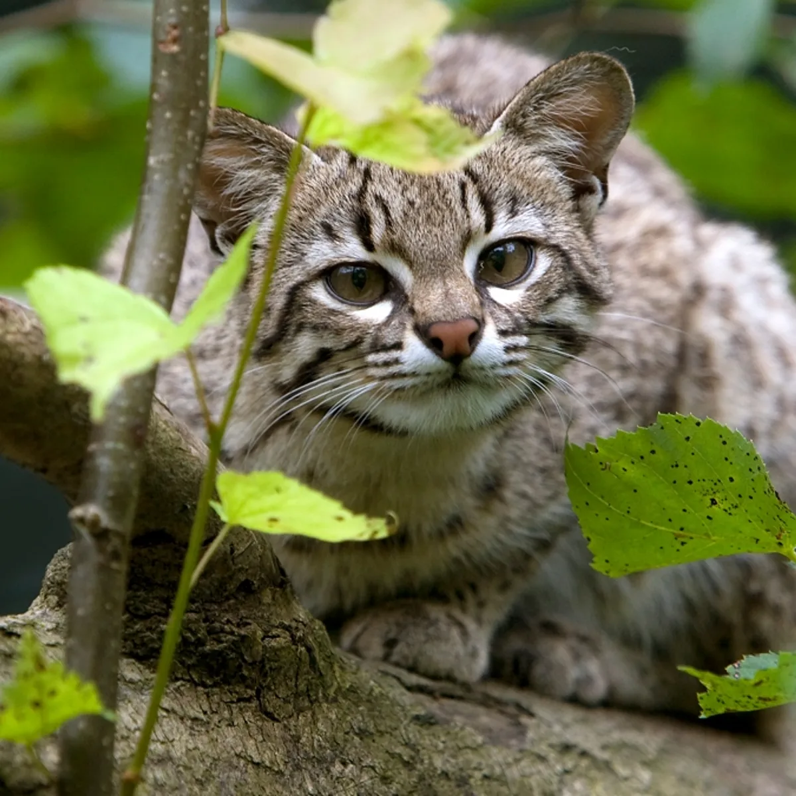

# Entrega 1: Propuesta de proyecyo y datos a trabajar

## Link de miro: https://miro.com/app/board/uXjVMuoV2_E=/

###### Inicialmente hicimos una lluvia de ideas con diferentes posibles temas, proponiendo cada uno un par que nos llamase la atención. Algunos de los primeros temas sugeridos fueron: 

* La pobreza en Chile en torno a la vivienda y campamentos
* Los habitos alimenticios en relación al veganismo, obesidad o menú Junaeb. 
* Casos del Sename de explotación o falta de funcionarios
* Disminución del interés para participar en elecciones electorales en el último tiempo
* Baja de personas lectoras en el país o librerías independientes en Chile
* Los desertores de la educación en Chile y America Latina

### Problemas de estos temas

1. Algunos de estos temas, como los desertores de la educación o la baja de interes el la lectura podrían tener datos de difícil acceso
2. Temas como la pobreza en Chile, los desertores de la educación o el interés para participar en las elecciones, si bien eran temas muy interesantes, sentíamos que tenían poco potencial para ser representados visualmente mediante lo que aprendamos a futuro en el curso.
3. Si bien no era obligación, queríamos investigar sobre un tema que no sea tan conocido, y varios de las primeras propuestas han sido muy habladas e informadas durante los últimos tiempos. 

## ¿La solución? Gatos

###### El tema surgió como idea de Cata y Fran, propusieron el tema de **los felinos endémicos en Chile**, en otras palabras, los gatos silvestres que están a lo largo de nuestro país. Por un lado, nos interesa explorar el cómo muchas de estas especies se encuentran en peligro de extinción y, al mismo tiempo, **mostrar la diversidad de especies** en Chile. Esto último sentimos que nos daba mucho juego para experimentar con información visual a futuro y tener un foco noticioso sobre estas especies, dandolas a conocer e indicando su peligro de extinción.

