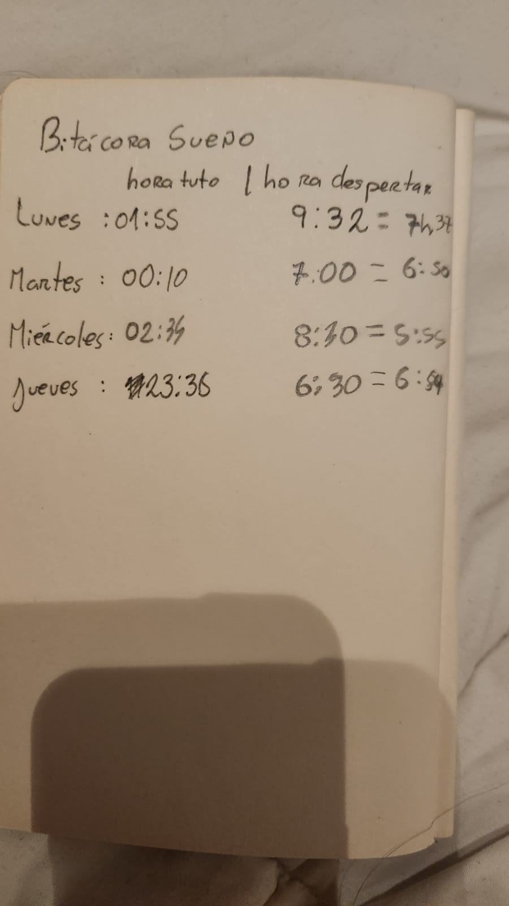

# Explicación Tarea 03

#### La principal idea era recolectar datos de las horas dormidas durante los días que fueron posibles en base a la hora que me iba a dormir y a la hora que despertaba. Para su recolección se hizo una bitácora manual durante los días pertinentes. A continuación fotografía de la bitácora: 

En base a esos datos se escribió en Collab un codigo para poder, primero, pasar los datos para luego sumar los tiempos y dividirlos en cantidad de días y en 60 (para pasar los minutos a horas). De ello salió el promedio de horas dormidas por día. Se adjunta al código y el csv final en los archivos de la carpeta Tarea_03.

Conclusiones de los datos: debería dormir más. 